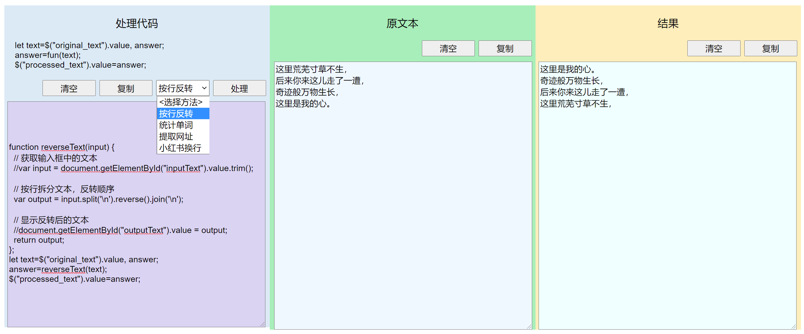

这是一个可以编写js代码对文本进行处理的静态网页工具。

github地址: https://github.com/vectorg/little-text-tool/

访问地址: https://vectorg.github.io/little-text-tool/

网页分为三栏，左边是要处理的文本，中间是处理的结果，右边是用来处理文本的代码。代码可以直接修改，有几个处理函数可以切换。

可以自定义处理函数并保存。点击"+新建方法+"，写好处理代码，在上方输入框中添加代码名称，点击保存，代码会被保存到localStorage中。下次打开网页时，会自动从localStorage中加载代码。

在手机上三栏纵向显示：

