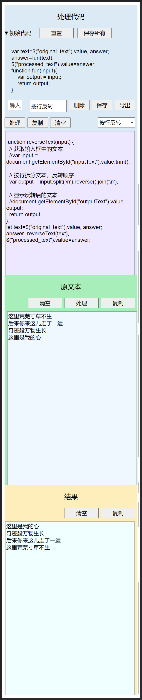

这是一个可以编写js代码对文本进行处理的静态网页工具。

github地址: https://github.com/vectorg/little-text-tool/

访问地址: https://vectorg.github.io/little-text-tool/

网页分为三栏，左边是要处理的文本，中间是处理的结果，右边是用来处理文本的代码。代码可以直接修改，有几个处理工具可以切换。

文本框的上方有清空、复制按钮可以使用。

在手机上三栏纵向显示：

