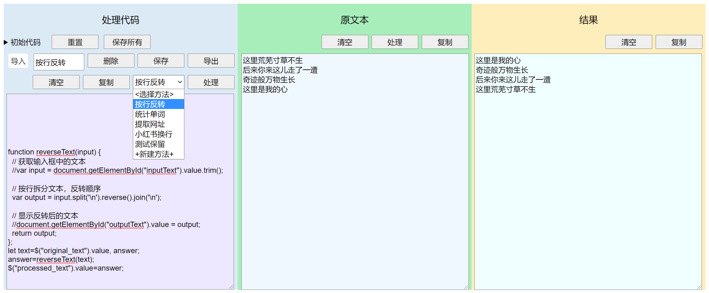

这是一个可以编写js代码对文本进行处理的静态网页工具。

github地址: https://github.com/vectorg/little-text-tool/

访问地址: https://vectorg.github.io/little-text-tool/

网页分为三栏，左边是要处理的文本，中间是处理的结果，右边是用来处理文本的代码。代码可以直接修改，有几个处理函数可以切换。

可以自定义处理函数并保存。点击"+新建方法+"，写好处理代码，在上方输入框中添加代码名称，点击保存，代码会被保存到localStorage中。下次打开网页时，会自动从localStorage中加载代码。

可以将localStorage导出到本地文件，也可以将导出的文件导入到网页。

注意：
- 保存按钮只会保存当前修改的代码(到localStorage)，也就是说代码未保存切换到其他选项就是放弃了；
- 导出只对localStorage进行，当前代码未保存时仍然不会保存、导出；
- 导入可能覆盖已有的同名称的代码；
- 导入时不会保存到localStorage，如需保存到localStorage要点击'保存所有'；
- 删除时需要保证命名处input值与选项名称相同(代码中已限制)；
- 保存时命名处input值不必与选项名称相同，但是不能为其他已有的选项名称(否则相当于替换掉)(代码中已限制)；

在手机上三栏纵向显示：

